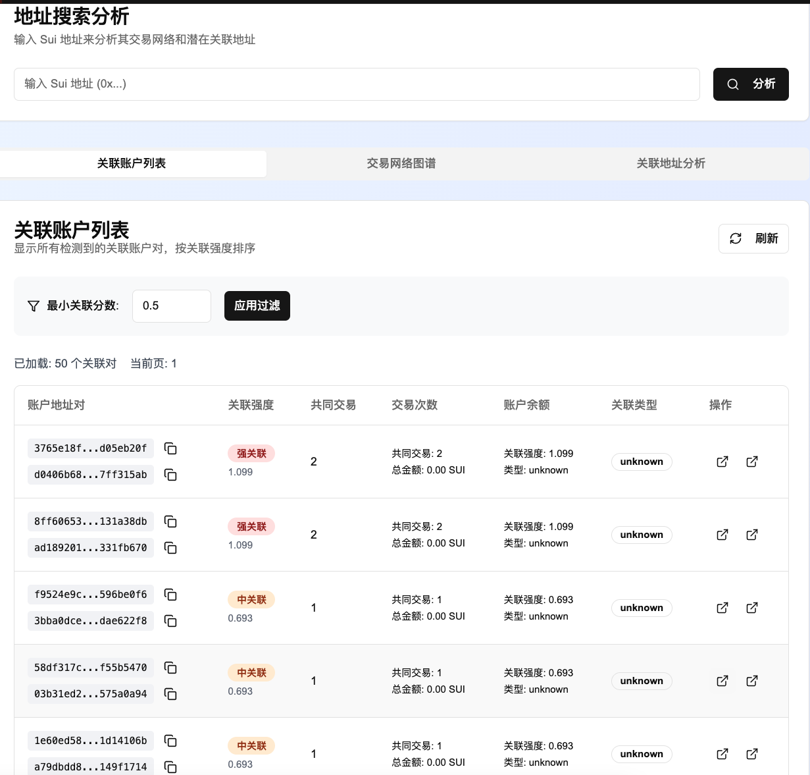
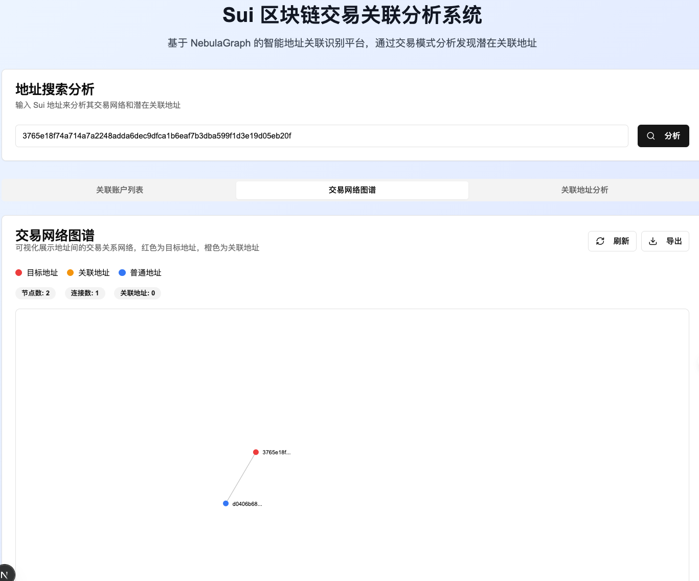
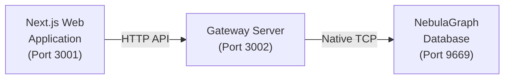

# 基于 NebulaGraph 的 Sui 分析器

一个基于 NebulaGraph 的 Sui 区块链交易分析工具，提供钱包地址关系分析、交易网络可视化和风险评估功能。

## 概览

关联账户列表：



交易网络可视化：




## 🏗️ 项目架构



为什么需要一个 Gateway Server ？

> 这是因为 Nebula 的 HTTP API 需要由 Nebula Gateway 提供
> 而 Nebula Gateway 对 Next.js Server 的兼容不太好（难以使用原生模块）
> 所以这里使用了一个纯粹的 Node.js 服务来连接并访问 Nebula Gateway


### 核心组件

1. **Next.js Web 应用** - 前端界面和 API 路由
2. **Gateway 服务器** - 独立的 NebulaGraph 查询服务
3. **NebulaGraph 数据库** - 图数据库存储交易关系

## 🚀 快速开始

### 前置要求

- Node.js 18+ 
- Docker 和 Docker Compose
- pnpm (推荐) 或 npm
  
### 0. Node.js

TODO: 放一个官网链接

> 如果已经安装过 Node.js 和 npm，但是需要切换版本
> 推荐试试 n 这个版本管理器：TODO：链接


### 1. 启动 NebulaGraph 数据库

确保你的 NebulaGraph Docker 容器正在运行：

```bash
# 检查容器状态
docker ps | grep nebula

# 如果没有运行，启动 NebulaGraph 集群
docker-compose up -d
```

### 2. 安装项目依赖

```bash
# 如果没有安装 pnpm
npm i pnpm -g

# 在根目录下执行，安装项目依赖
pnpm install
```

### 3. 启动项目

```bash
# 同时启动 Gateway 服务器和 Web 应用
pnpm run start:all
```


## 📊 数据结构

### 节点类型
- `wallet` - 钱包地址节点

### 边类型
- `transaction` - 交易关系
- `related_to` - 关联关系


## 🔧 配置


## 🤝 贡献

欢迎提交 Issues 和 Pull Requests！

## 📄 许可证

MIT License

