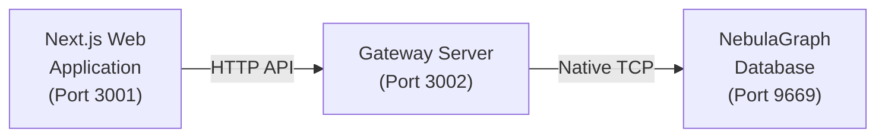
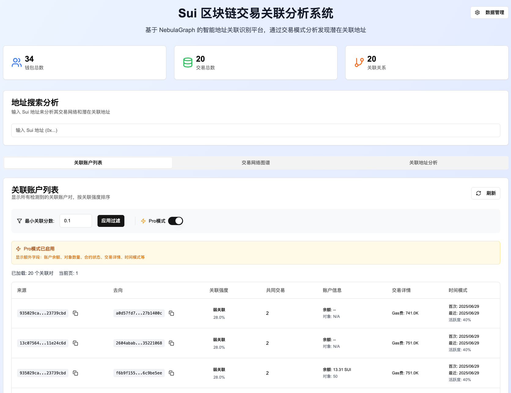
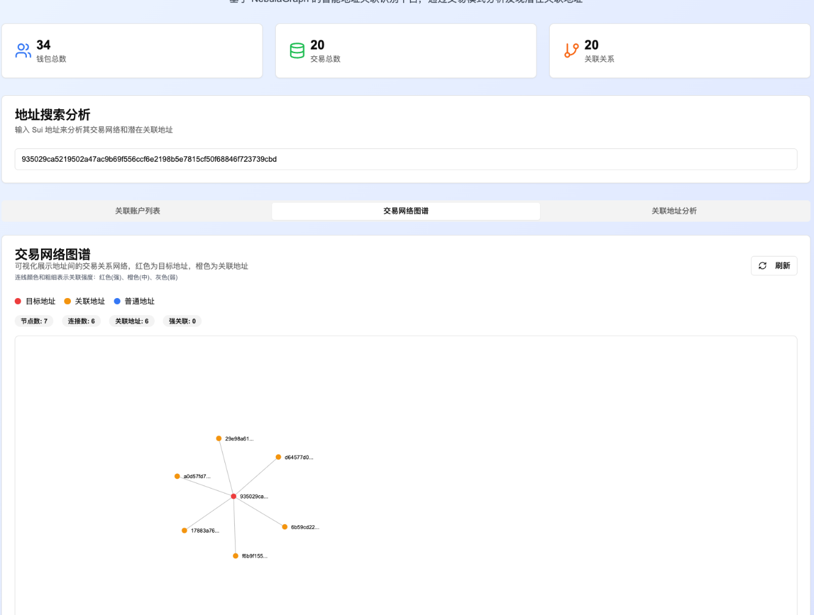
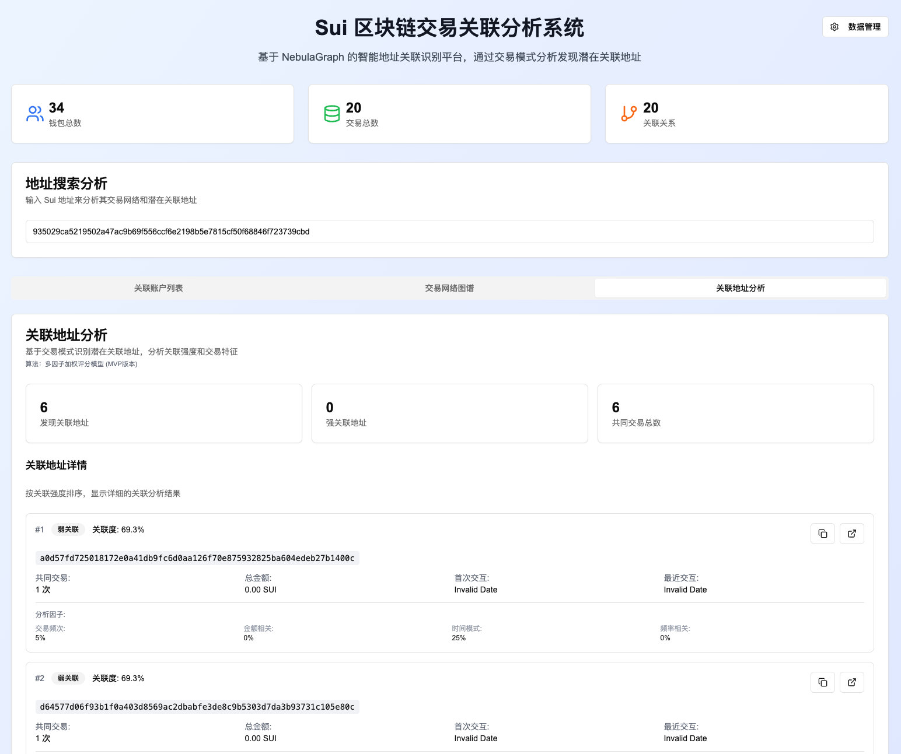
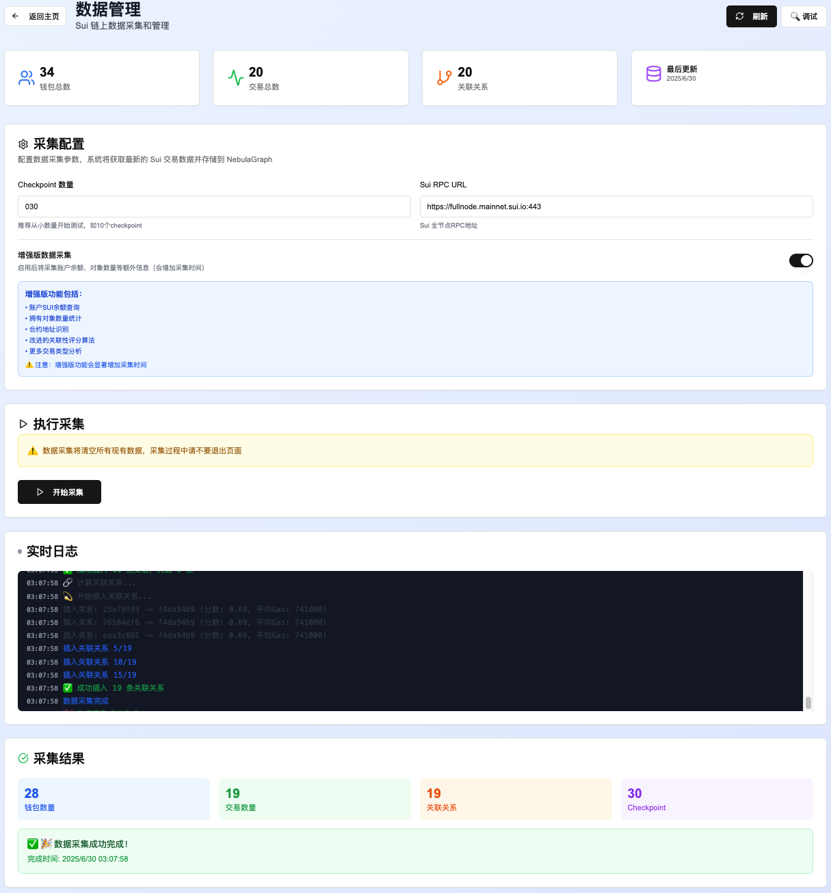

# 基于 NebulaGraph 的 Sui 链上关系分析器

一个创新的 Sui 区块链数据分析平台，采用 **NebulaGraph 图数据库**进行深度关系挖掘。
支持**自动化链上数据采集**、**交易关系分析算法**、**交易网络可视化**，帮助用户发现隐藏的钱包关联关系和风险模式。

## 🏗️ 项目架构



为什么需要一个 Gateway Server ？

> 这是因为 Nebula 的 HTTP API 需要由 Nebula Gateway 提供
> 
> 而 Nebula Gateway 对 Next.js Server 的兼容不太友好（难以使用原生模块）
> 
> 所以这里使用了一个纯粹的 Node.js 服务来连接并访问 Nebula Gateway


## 功能概览

### 关联账户列表：



### 交易网络可视化：




### 关联账户详情



### 自动扫链收集数据




## 🚀 快速开始

### 前置要求

- Node.js 18+ 
- Docker（用于安装 NebulaGraph）
- pnpm (推荐) 或 npm
  
### 1. 启动 NebulaGraph 数据库

确保你的 NebulaGraph Docker 容器正在运行：

```bash
# 检查容器状态
docker ps | grep nebula

# 如果没有运行，启动 NebulaGraph 集群
docker-compose up -d
```

### 2. 安装项目依赖

```bash
# 如果没有安装 pnpm
npm i pnpm -g

# 在根目录下执行，安装项目依赖
pnpm install
```

### 3. 启动项目

```bash
# 同时启动 Gateway 服务器和 Web 应用
pnpm run start:all
```


## 🌟 为什么选择 Sui？

### Sui vs Eth：

| 特性 | **Sui** | **Eth** |
|------|---------|----------------------|
| **数据模型** | 对象模型（Object-based） | 账户模型（Account-based） |
| **并发处理** | 原生并行执行 | 顺序执行，易拥堵 |
| **Gas机制** | 固定Gas价格，低费用 | 动态Gas价格，波动大 |
| **交易类型** | TransferSui, TransferObjects | Transfer, Contract Call |
| **状态存储** | 对象独立存储 | 全局状态树 |
| **TPS** | 理论无上限（并行） | ~15 TPS |
| **开发语言** | Move | Solidity |

### Sui 的特点

**Sui** 由 Mysten Labs 于 **2022年** 推出的 L1。其核心理念包括：

- **🎯 用户体验优先**: 通过并行执行和低延迟
- **🔗 对象中心设计**: 每个数字资产都是独立的对象，支持复杂的所有权和转移逻辑  
- **⚡ 高扩展性**: 利用对象模型实现水平扩展，理论上可以无限提升 TPS
- **🛡️ 安全性**: 采用 Move 编程语言，在字节码级别防止常见的智能合约漏洞


## 🔍 NebulaGraph 的核心价值

### 为什么选择图数据库？

在区块链关系分析中，传统的关系型数据库面临以下挑战：
- **多跳关系查询性能差**: SQL 的多表 JOIN 在复杂关系网络中表现不佳
- **动态关系难以建模**: 钱包之间的关联关系是动态变化的
- **图算法支持有限**: 缺乏原生的图计算能力

### NebulaGraph 的技术优势

- **🔍 复杂关系查询**: 支持多跳关系、路径分析、环检测等图查询
- **⚡ 高性能图计算**: 原生支持PageRank、社区发现、中心性算法
- **📈 实时分析**: 亚秒级响应复杂关系查询
- **🔧 灵活建模**: 轻松适应区块链数据的动态特性


### NebulaGraph 的应用

我们在各个功能模块中大量使用了NebulaGraph的图查询能力，以下是项目中的实际应用：

#### 本项目中使用的查询

##### 📊 数据统计查询（app/page.tsx）

```sql
-- 统计钱包总数（app/page.tsx）
USE sui_analysis; 
MATCH (n:wallet) RETURN count(n) as count;

-- 统计交易总数
USE sui_analysis; 
MATCH ()-[e:transaction]->() RETURN count(e) as count;

-- 统计关联关系总数
USE sui_analysis; 
MATCH ()-[r:related_to]->() RETURN count(r) as count;
```

##### 🔗 关联账户列表查询（components/related-accounts.tsx）

```sql
-- 基础模式：查询关联关系
USE sui_analysis; 
MATCH (a:wallet)-[r:related_to]-(b:wallet) 
WHERE r.relationship_score >= 0.1 
RETURN a.wallet.address AS addr1, 
       b.wallet.address AS addr2, 
       r.relationship_score AS score, 
       r.common_transactions AS common_tx, 
       r.total_amount AS amount 
LIMIT 50;

-- Pro模式：查询增强字段
USE sui_analysis; 
MATCH (a:wallet)-[r:related_to]-(b:wallet) 
WHERE r.relationship_score >= 0.1 
RETURN a.wallet.address AS addr1, 
       b.wallet.address AS addr2, 
       r.relationship_score AS score, 
       r.common_transactions AS common_tx, 
       r.total_amount AS amount,
       r.avg_gas_used AS avg_gas,
       r.first_interaction AS first_interaction,
       r.last_interaction AS last_interaction,
       r.relationship_type AS rel_type,
       a.wallet.sui_balance AS addr1_balance,
       a.wallet.owned_objects_count AS addr1_objects,
       a.wallet.is_contract AS addr1_contract
LIMIT 50;

-- 备用查询：从交易边推断关联（当没有预计算关系时）
USE sui_analysis; 
MATCH (a:wallet)-[r:transaction]-(b:wallet) 
RETURN a.wallet.address AS addr1, 
       b.wallet.address AS addr2, 
       r.amount AS amount,
       r.gas_used AS gas_used,
       r.success AS success,
       r.transaction_type AS tx_type,
       r.tx_timestamp AS tx_time,
       a.wallet.sui_balance AS addr1_balance,
       a.wallet.owned_objects_count AS addr1_objects,
       a.wallet.is_contract AS addr1_contract
LIMIT 200;
```

##### 🎯 地址分析查询（components/address-analysis.tsx）

```sql
-- 查询目标地址基本信息
USE sui_analysis; 
MATCH (target:wallet) 
WHERE id(target) == "${searchAddress}" 
RETURN target.wallet.address AS address, 
       target.wallet.transaction_count AS tx_count, 
       target.wallet.total_amount AS total_amount, 
       target.wallet.first_seen AS first_seen, 
       target.wallet.last_seen AS last_seen;

-- 查询目标地址的关联账户  
USE sui_analysis; 
MATCH (target:wallet)-[r:related_to]-(related:wallet) 
WHERE id(target) == "${searchAddress}" 
RETURN related.wallet.address AS address, 
       r.relationship_score AS score, 
       r.common_transactions AS common_tx, 
       r.total_amount AS total_amount, 
       r.first_interaction AS first_interaction, 
       r.last_interaction AS last_interaction, 
       r.relationship_type AS type 
LIMIT 20;

-- 备用：从交易边分析关联
USE sui_analysis; 
MATCH (target:wallet)-[r:transaction]-(related:wallet) 
WHERE id(target) == "${searchAddress}" 
RETURN related.wallet.address AS address, 
       related.wallet.transaction_count AS tx_count, 
       related.wallet.total_amount AS amount, 
       r.amount AS tx_amount, 
       r.tx_timestamp AS tx_time 
LIMIT 10;
```

##### 📈 交易网络图谱查询（components/transaction-graph.tsx）

```sql
-- 查询中心节点信息
USE sui_analysis; 
MATCH (center:wallet) 
WHERE id(center) == "${searchAddress}" 
RETURN center.wallet.address AS center_address, 
       center.wallet.transaction_count AS center_tx_count, 
       center.wallet.total_amount AS center_amount;

-- 查询网络连接关系
USE sui_analysis; 
MATCH (center:wallet)-[r:transaction]-(connected:wallet) 
WHERE id(center) == "${searchAddress}" 
RETURN connected.wallet.address AS connected_address, 
       connected.wallet.transaction_count AS connected_tx_count, 
       connected.wallet.total_amount AS connected_amount, 
       r.amount AS edge_amount, 
       r.tx_timestamp AS tx_time 
LIMIT 50;
```

##### 💾 数据管理语句（app/api/data-collection/route.ts）

```sql
-- 图空间管理
DROP SPACE IF EXISTS sui_analysis;
CREATE SPACE IF NOT EXISTS sui_analysis (partition_num = 10, replica_factor = 1, vid_type = FIXED_STRING(64));

-- 创建标签和边类型（增强模式）
USE sui_analysis; 
CREATE TAG IF NOT EXISTS wallet (
  address string NOT NULL, 
  first_seen datetime, 
  last_seen datetime, 
  transaction_count int DEFAULT 0, 
  total_amount double DEFAULT 0.0, 
  is_contract bool DEFAULT false, 
  sui_balance double DEFAULT 0.0, 
  owned_objects_count int DEFAULT 0, 
  last_activity datetime
);

USE sui_analysis; 
CREATE EDGE IF NOT EXISTS transaction (
  amount double NOT NULL, 
  tx_timestamp datetime NOT NULL, 
  tx_hash string NOT NULL, 
  gas_used int DEFAULT 0, 
  success bool DEFAULT true, 
  transaction_type string DEFAULT 'unknown'
);

USE sui_analysis; 
CREATE EDGE IF NOT EXISTS related_to (
  relationship_score double NOT NULL, 
  common_transactions int DEFAULT 0, 
  total_amount double DEFAULT 0.0, 
  first_interaction datetime, 
  last_interaction datetime, 
  relationship_type string DEFAULT "unknown", 
  avg_gas_used double DEFAULT 0.0
);

-- 插入钱包节点（动态生成）
USE sui_analysis; 
INSERT VERTEX wallet(address, first_seen, last_seen, transaction_count, total_amount, is_contract, sui_balance, owned_objects_count, last_activity) 
VALUES "${wallet.address}": ("${wallet.address}", datetime("${wallet.first_seen}"), datetime("${wallet.last_seen}"), ${wallet.transaction_count}, ${wallet.total_amount}, ${wallet.is_contract}, ${wallet.sui_balance}, ${wallet.owned_objects_count}, datetime("${wallet.last_activity}"));

-- 插入交易边（动态生成）
USE sui_analysis; 
INSERT EDGE transaction(amount, tx_timestamp, tx_hash, gas_used, success, transaction_type) 
VALUES "${edge.src}" -> "${edge.dst}": (${edge.amount}, datetime("${edge.timestamp}"), "${edge.tx_hash}", ${edge.gas_used}, ${edge.success}, "${edge.transaction_type}");

-- 插入关联关系边（动态生成）
USE sui_analysis; 
INSERT EDGE related_to(relationship_score, common_transactions, total_amount, first_interaction, last_interaction, relationship_type, avg_gas_used) 
VALUES "${r.src}" -> "${r.dst}": (${r.relationship_score}, ${r.common_transactions}, ${r.total_amount}, datetime("${r.first_interaction}"), datetime("${r.last_interaction}"), "${r.relationship_type}", ${r.avg_gas_used});
```

#### 可选的扩展查询

这些高级查询展示了NebulaGraph的强大能力，可用于进一步的功能扩展：

##### 🚀 高级图算法应用

```sql
-- 多跳关系分析：发现资金流转路径
USE sui_analysis;
MATCH path = (start:wallet)-[r:related_to*1..3]-(end:wallet)
WHERE start.wallet.address = "source_addr"  
  AND end.wallet.address = "target_addr"
  AND ALL(rel in r WHERE rel.relationship_score > 0.3)
RETURN path, [rel in r | rel.relationship_score] as scores;

-- 社区发现：识别紧密关联的钱包集群  
USE sui_analysis;
MATCH (a:wallet)-[r:related_to]-(b:wallet)
WHERE r.relationship_score > 0.6
WITH a, collect(b) as connected_wallets
WHERE size(connected_wallets) >= 3
RETURN a.wallet.address, connected_wallets;

-- 中心性分析：计算钱包在网络中的重要性
USE sui_analysis;
MATCH (center:wallet)-[r:related_to]-(connected:wallet)
RETURN center.wallet.address, 
       COUNT(connected) as degree_centrality,
       AVG(r.relationship_score) as avg_strength
ORDER BY degree_centrality DESC;

-- 风险分析：查找高风险关联账户
USE sui_analysis;
MATCH (a:wallet)-[r:related_to]-(b:wallet)
WHERE r.relationship_score > 0.7 
  AND r.common_transactions > 5
RETURN a.wallet.address, b.wallet.address, 
       r.relationship_score, r.common_transactions
ORDER BY r.relationship_score DESC;

-- 最短路径分析：查找地址间的资金流转路径
USE sui_analysis;
MATCH path = shortestPath((start:wallet)-[*..5]-(end:wallet))
WHERE start.wallet.address = "addr1" AND end.wallet.address = "addr2"
RETURN path, length(path);
```

#### 🎯 NebulaGraph 核心优势体现

**1. 图原生查询能力**
- 一条nGQL语句即可完成复杂的多跳关系分析
- 无需多次JOIN操作，性能远超传统SQL

**2. 实时计算支持**  
- 亚秒级响应百万级节点的关系查询
- 支持动态图算法计算（中心性、社区发现等）

**3. 灵活的数据模型**
- VID支持字符串类型，直接使用钱包地址作为节点ID
- 属性图模型完美适配区块链数据的复杂关系

**4. 高效聚合分析**
- 原生支持COUNT、AVG、SUM等聚合函数
- WITH子句支持复杂的数据流转换


## 📊 数据架构与算法

### 数据模型设计

#### 节点类型 (Vertices)
- **`wallet`** - 钱包地址节点
  ```
  properties: {
    address: string,           // 钱包地址 (VID)
    first_seen: datetime,      // 首次出现时间  
    last_seen: datetime,       // 最后活跃时间
    transaction_count: int,    // 交易次数
    total_amount: double,      // 总交易金额
    is_contract: bool,         // 是否为合约地址
    sui_balance: double,       // SUI余额 (增强模式)
    owned_objects_count: int,  // 拥有对象数 (增强模式)
    last_activity: datetime    // 最后活跃时间 (增强模式)
  }
  ```

#### 边类型 (Edges)
- **`transaction`** - 直接交易关系
  ```
  properties: {
    amount: double,           // 交易金额
    tx_timestamp: datetime,   // 交易时间
    tx_hash: string,         // 交易哈希
    gas_used: int,           // Gas消耗
    success: bool,           // 交易状态
    transaction_type: string  // 交易类型 (增强模式)
  }
  ```

- **`related_to`** - 计算得出的关联关系
  ```
  properties: {
    relationship_score: double,     // 关联强度分数 [0,1]
    common_transactions: int,       // 共同交易次数
    total_amount: double,          // 总交易金额
    first_interaction: datetime,   // 首次交互时间
    last_interaction: datetime,    // 最近交互时间
    relationship_type: string,     // 关系类型 (strong/medium/weak)
    avg_gas_used: double          // 平均Gas消耗 (增强模式)
  }
  ```

## 🕷️ 链上数据采集策略

### 采集范围与深度

我们的爬虫采集以下Sui链上数据：

#### 🎯 数据来源
- **Checkpoint范围**: 可配置采集最新N个checkpoint（默认10个）
- **RPC端点**: 支持多个Sui全节点RPC（默认官方节点）
- **交易类型**: 专注于 `TransferSui` 和 `TransferObjects` 交易

#### 📦 采集数据类型

这里提供了两种采集模式，用于针对不同场景。

**基础模式采集:**

- 钱包地址
- 钱包活跃时间
- tx 关系
- tx 金额
- Gas消耗
- tx 状态  
- tx hash
- tx 时间

**增强模式采集 (Pro):**

耗时更多，但是采集的数据更丰富，在基础模式之外拓展了以下字段：

- 🔥 **实时余额查询**: 通过 `suix_getBalance` 获取SUI余额
- 🎯 **对象数量统计**: 通过 `suix_getOwnedObjects` 统计拥有的对象数量
- 🏷️ **合约地址识别**: 检测 Package 类型对象，区分合约地址
- 📊 **交易类型标注**: 区分 TransferSui 和 TransferObjects

### 采集实现

```javascript
// 核心采集逻辑示例
for (let seq = startCheckpoint; seq <= latestCheckpoint; seq++) {
  const checkpoint = await rpc("sui_getCheckpoint", [String(seq)]);
  
  for (const txDigest of checkpoint.transactions) {
    const tx = await rpc("sui_getTransactionBlock", [txDigest, options]);
    
    // 解析可编程交易
    const cmds = tx.transaction?.data?.transaction?.transactions || [];
    for (const cmd of cmds) {
      if (cmd.TransferSui || cmd.TransferObjects) {
        // 提取发送方和接收方关系
        // 构建图数据结构
      }
    }
  }
}
```

## 🧮 关联关系分析算法

### 核心算法：多因子关联性评分

目前采用**图计算驱动**的关联性分析，结合多个维度计算钱包之间的关联强度：

> ⚠️ 这个算法没有经过任何研究证明，本项目更侧重于展示工程架构实现，所使用的关系分析算法不适用于生产环境

#### 📐 评分公式

```
关联强度 = 交易频率得分 × 0.7 + 金额权重得分 × 0.3

其中：
- 交易频率得分 = min(共同交易次数 / 5, 1.0)  
- 金额权重得分 = min(log10(总交易金额 + 1) / 10, 1.0)
```

#### 🎯 分级体系

| 关联强度范围 | 等级标签 | 颜色标识 | 说明 |
|-------------|----------|----------|------|
| 0.7 - 1.0 | **强关联** | 🔴 红色 | 高频交易，可能为关联账户 |
| 0.4 - 0.69 | **中等关联** | 🟡 黄色 | 定期交易，存在一定关联 |  
| 0.1 - 0.39 | **弱关联** | 🟢 绿色 | 少量交易，偶然关联 |

## 🤝 贡献指南

欢迎提交 Issues 和 Pull Requests！

## 📄 许可证

MIT License

